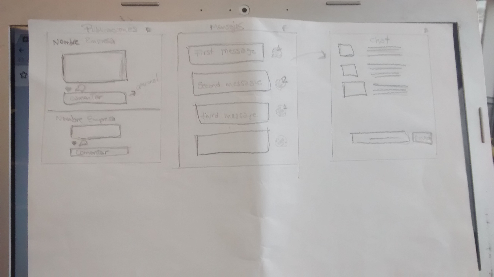
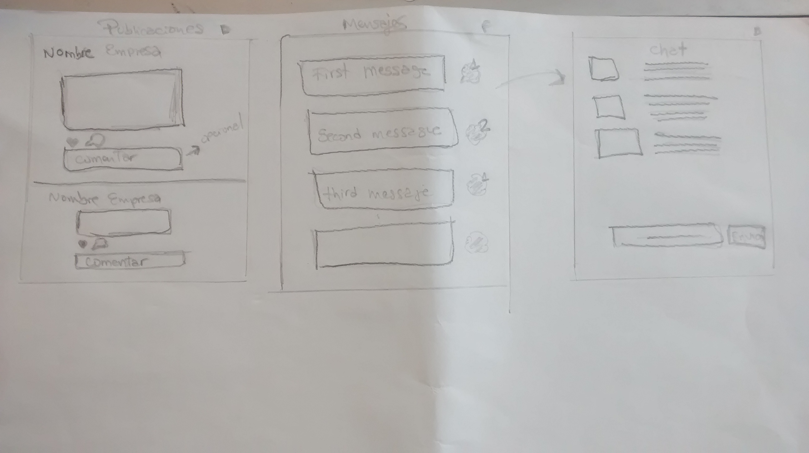

#  RED SOCIAL ** JUMPBUSS**

###### Integrantes:
- Daniela Gonzales
- Flora Huerta

**En el Peru hay un gran porcentaje de MYPES que ocupan el 95% de las empresas a nivel nacional , viendo esta amplia necesidad  creamos esta red social  llamada   ** JUMPBUSS** enfocado principalmente en las micro y pequeñas empresas .**

#### OBJETIVO :
Colaborar para dar impulso a las mypes , brindando facilidades mediante esta red social para que puedan promover sus negocios y obtener un mayor alcance hacia más personas.

### Publico Objetivo :
- Micro y pequeñas empresas.

### Flujo de trabajo

Organizamos las tareas  mediante una serie pasos , los cuales organizamos con Trello.

---
+  Nos reunimos para elegir el tema y trazarnos objetivos .
+ Realizamos entrevistas a un grupo de usuarios .
+  Realizamos  sketchs de las vistas.  

+ Designacion de tareas.
+ Maquetacion de las vistas.
+ Codificacion de funcionalidad , validaciones .

### Recursos :
- Bootstrap 4
- JQuery
- Trello
- Icomoon
- LocalStorage

### Funcionalidad
Explicaremos en breve , en que consiste las funcionalidades de este trabajo :
Se podran registrar en esta red social tanto empresas como personas ;
+ Empresas:
Las empresas podran registrarse e ingresar a su perfil , donde se encontrara la informacion de su ubicacion, contacto,etc.
+ Personas:
Las personas tambien podran registrase
e ingresar para poder observar toda la informacion de las empresas y podran seguir todas las publicaciones de las mismas.

#### Implementacion de funcionalidades a futuro:
- Implementacion de un chat a tiempo real.
- Uso de un gestor de base de datos .
- Funcionalidad de mensajeria.
